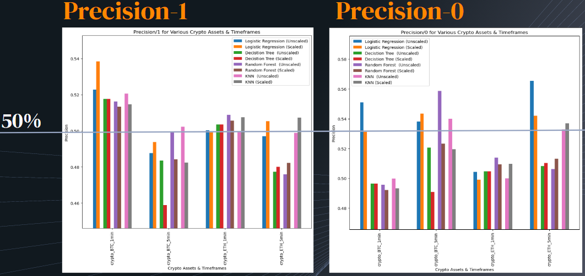

# Columbia Fintech Bootcamp: "OB ORACLE" (Project #2)

---

Feature Summary: Machine Learning High Frequency Trading Crypto Order Book Prediction + Trading Bot

Machine Learning model that forecasts the price direction and movement in the order book. This article contains a full-cycle of research: getting data, visualization, feature engineering, modeling, fine-tuning of the algorithm, and quality estimation


- Project Goals:

    - Goal #1: Using machine learning models on a high frequency trading (HFT) crypto order book to predict price direction and price levels.
    - Goal #2: Develop a  strategy trading bot to place mock trades on predicted outcomes from ML models and compare actual versus realized strategy returns

---

## Technologies

This project leverages python 3.9 with the following packages:
- [pandas](https://github.com/pandas-dev/pandas) - A powerful data analysis toolkit.
- [numpy](https://numpy.org/) - A core library for scientific computing in Python
- [matplotlib](https://matplotlib.org/) - Tools for creating static, animated, and interactive visualizations
- [hvplot](https://hvplot.holoviz.org/) - High-level API for data exploration and visualization
- [seaborn](https://seaborn.pydata.org/) - Statistical data visualization tools
- [sklearn](https://scikit-learn.org/) - Simple and efficient tools for predictive data analysis
- [imblearn](https://imbalanced-learn.org/) - Provides tools when dealing with classification with imbalanced classes
- [tensorflow](https://www.tensorflow.org/) - An end-to-end open source platform for machine learning

This project leverages python 3.9 with the following packages:

Jupyter Lab 3.3.2 is required

- *Jupyter Lab is primarily used as a web-based development environment for the notebooks, code, and data associated with this project.  Its flexible interface allows users to configure and arrange workflows in data science*

---

## Installation Guide

Before running the application first install the following dependencies.

```python
  pip install pandas
  pip install numpy
  pip install sklearn
  pip install imblearn
  pip install matplotlib
  pip install seaborn
  pip install hvplot

```
*Assumption made for module challenge: the* **sys** *and Path module will not be required to be explicitely called out in Installation guide section*

To run Jupyter Lab, need to install Anaconda:
- [Anaconda](https://docs.anaconda.com/anaconda/install/) - an open-source distribution of the Python
---

## Usage

To run the Machine Learning Trading Bot application, simply clone the repository and run the following jupyter lab scripts:
<br>

- <ins>**Crypto Order Book Processing:**</ins>

    - <font color="Cyan"><ins>crypto_orderbook_process.ipynb:</ins></font>   Order Book feature selection/engineering for the process of selecting, manipulating, and transforming raw data into features.
    - <font color="Cyan"><ins>crypto_orderbook_visualization.ipynb:</ins></font>    Visual inspection/confirmation of of order book features
<br>
    
- <ins>**Machine Learning Supervised Learning:**</ins>
    
    - <font color="Cyan"><ins>supervised_learning_midpoint.ipynb:</ins></font>   Using machine learning supervised learning techniques to predict the direction and price movement of the "midpoint" price in the order book.
    - <font color="Cyan"><ins>supervised_learning_imbalance.ipynb:</ins></font>   Using machine learning supervised learning techniques to predict the direction of the bid-ask imbalance at each level in the orde book.
    - <font color="Cyan"><ins>supervised_learning_midpoint_permutate.ipynb:</ins></font>   Permuate through supervised_learning_midpoint.ipynb on different crypto assets and time frames (Assets: BTC, ETH, ADA; Timeframes: 5min, 1min)
    - <font color="Cyan"><ins>supervised_learning_imbalance_permutate.ipynb:</ins></font>   Permuate through supervised_learning_imbalance.ipynb on different crypto assets and time frames (Assets: BTC, ETH, ADA; Timeframes: 5min, 1min)
    - <font color="Cyan"><ins>supervised_learning_imbalance_kelly.ipynb:</ins></font>    Use the Kelly Criterion on the strategy trading bot and compare to supervised_learning_imbalance.ipynb
<br>
    
- <ins>**Machine Learning Deep Learning:**</ins>
    
    - <font color="Cyan"><ins>deep_learning_midpoint.ipynb:</ins></font>   Using machine learning deep learning techniques to predict the direction and price movement of the "midpoint" price in the order book.
    - <font color="Cyan"><ins>deep_learning_imbalance.ipynb:</ins></font>   Using machine learning supervised learning techniques to predict the direction of the bid-ask imbalance at each level in the orde book
    - <font color="Cyan"><ins>deep_learning_midpoint_permutate.ipynb:</ins></font>   Permuate through deep_learning_midpoint.ipynb on different crypto assets and time frames (Assets: BTC, ETH, ADA; Timeframes: 5min, 1min)
    - <font color="Cyan"><ins>deep_learning_imbalance_permutate.ipynb:</ins></font>    Permuate through deep_learning_imbalance.ipynb on different crypto assets and time frames (Assets: BTC, ETH, ADA; Timeframes: 5min, 1min)
    - <font color="Cyan"><ins>deep_learning_lstm_regression.ipynb:</ins></font>    Machine learning price prediction using LSTM model
    - <font color="Cyan"><ins>deep_learning_gradientboost_midpoint.ipynb:</ins></font>   Machine learning price prediction using gradient boosting model
<br>

---

## Order Book Semantics

<body>
    - <font color="Cyan"><b>Limit order</b></font> is an order you place on the order book with a specific limit price<br> 
    - <font color="Cyan"><b>Top of Book</b></font> represents the highest bid and the lowest ask that time.<br> 
    - <font color="Cyan"><b>bid-ask spread</b></font> is the amount by which the ask price exceeds the bid price for an asset in the market.<br>
    - <font color="Cyan"><b>Market orders</b></font> let you purchase instantly at best price currently available.<br>
    - <font color="Cyan"><b>Mid-price</b></font> is the price between the best price of the sellers offer price and best price of the buyers bid price.<br>
    - <font color="Cyan"><b>Liquidity</b></font> refers to how rapidly shares of a stock can be bought or sold without substantially impacting the stock stock price.<br>  
<body>
    
---
    
## Crypto Order Book Feature Engineering

Crypto PROVIDED order book features/columns (_x represent order book level)

- <font color="Cyan">midpoint</font> = the midpoint between the best bid and the best ask<br>
- <font color="Cyan">spread</font> = the difference between the best bid and the best ask<br>

- <font color="Cyan">bids/asks_distance_x</font> = the distance of bid/ask level x from the midprice in %<br>
                                                 = (price - midpoint) / midpoint<br>

- <font color="Cyan">bids/asks_limit/market/cancel_notional_x</font> = volume (= price * quantity) of orders at bid/ask level_x<br>
- <font color="Cyan">bids/asks_notional_x</font> = (asks_limit_notional_x - asks_market_notional_x - asks_cancel_notional_x)<br>
    
New DERIVED order book features/columns developed in this notebook/python script

- <font color="Cyan">bids/ask_price_x</font> = the price at bid/ask level_x<br>
                                             = midpoint * (1 + distance)  (wehere distance is represented as %)<br>

- <font color="Cyan">bids/asks_limit/market/cancel_quantity_x</font> = quantity (= bids/asks_limit/market/cancel_notional_x / bids/ask_price_x) of orders at bid/ask level_x<br>
    
- <font color="Cyan">bids/asks_limit/market/cancel_cum_quantity_</font> = Cumulative sum of quantities - i.e. bids/asks_limit/market/cancel_quantity_x<br>
                                                     Example. cum_quantity_0 = quantity_0<br>
                                                              cum_quantity_1 = quantity_0 + quantity_1<br>
                                                              cum_quantity_2 = quantity_0 + quantity_1 + quantity_2<br>
                                                              ...

- <font color="Cyan">bids/asks_limit/market/cancel_cum_notional_x</font> = Cumulative sum of notionals - i.e. bids/asks_limit/market/cancel_notional_x<br>
                                                     Example. cum_notional_0 = notional_0<br>
                                                              cum_notional_1 = notional_0 + notional_1<br>
                                                              cum_notional_2 = notional_0 + notional_1 + notional_2<br>
                                                              ...
- <font color="Cyan">bid_ask_imbalance_limit/market/cancel_notiona_x</font> = Bid Ask Imbalance = (bid notional / (bid notional + ask notional))<br>
                                                                            =  bids_limit/market/cancel_notional_x / (bids_limit/market/cancel_notional_x + asks_limit/market/cancel_notional_x)   <br>
    
---  
    
## Crypto Order Book Visualizations

<br>
<br>
<br>

---            
    
### Framework for ML Limit Order Strategy


---  
    
### Strategy Trading Bot Flowchart (Classification Model)


---      

### Classification Report (Midpoint + Imbalance Modelling)
<br>

---            

### Classification Visualizations
<br>
<br>
<br>

---            

### Supervised Learning Actual / ML Strategy Returns
<br>
<br>

---
    
### ML Neural Network Model Validation Permutations
<br>
    
---            

### ML Neural Network Dense Strategy Bot Results
<br>

### ML Neural Network LSTM Strategy Bot Results
<br>

---

### Supervised Learning w/ Kelly Criterian Actual / ML Strategy Returns
<br>
<br>

---
    
## Contributors

Contributors:
- Sharma, Nitesh
- Gavnoudias, Stratis
- Gorelenkov, Boris
- Lopez, Liset
- Wolfenbarger, William
    
---
    
## License

GNU GENERAL PUBLIC LICENSE Version 3, 29 June 2007
